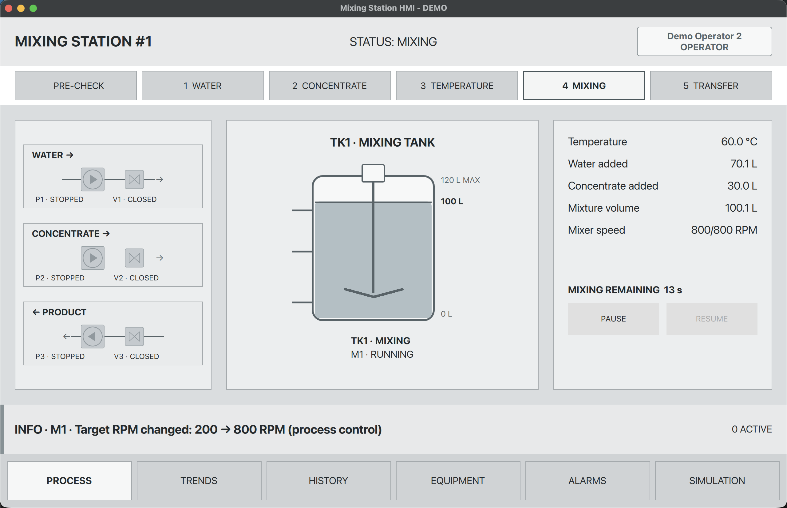

# Łukasz Citko | C++ and Qt Portfolio

This repository presents my work with C++, Qt/QML and software for industrial processes. Each project has its own documentation, source code and tests.

## Projects

### [MixingStationHMI](projects/MixingStationHMI/)

A touch-oriented HMI simulation for a batch mixing station. The application guides a batch through pre-start checks, water filling, concentrate dosing, temperature validation, mixing and transfer. Equipment faults can pause the process, while events and trend samples are saved for later review.

**Technologies:** C++, Qt 6.8, QML, SQLite, CMake and Qt Test.

**What the project demonstrates:**

- A C++ batch controller with process states and fault recovery.
- A 1280 × 800 touch interface built with Qt Quick.
- SQLite persistence for users, runs, events and historical trends.
- Automated tests for process behaviour, permissions and database operations.

[Project overview and build instructions](projects/MixingStationHMI/README.md) ·
[C++ source](projects/MixingStationHMI/src/) ·
[QML interface](projects/MixingStationHMI/qml/) ·
[Tests](projects/MixingStationHMI/tests/) ·
[Illustrated guide](projects/MixingStationHMI/docs/MixingStationHMI-Guide.pdf)

This is a portfolio simulation. It does not control physical equipment or authenticate users.

**Planned next phase:** an ARM-based Embedded Linux deployment with a replaceable simulation/Modbus process I/O backend. See the [Embedded Linux roadmap](projects/MixingStationHMI/README.md#roadmap-embedded-linux).

## License

The original code and documentation in this repository are available under the
[MIT License](LICENSE). Third-party frameworks and dependencies retain their
own licenses.
