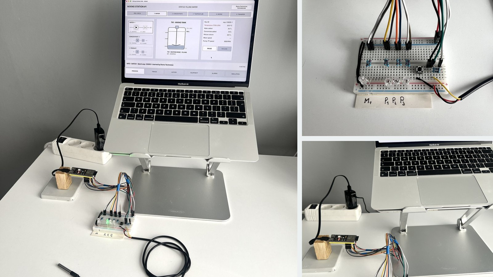
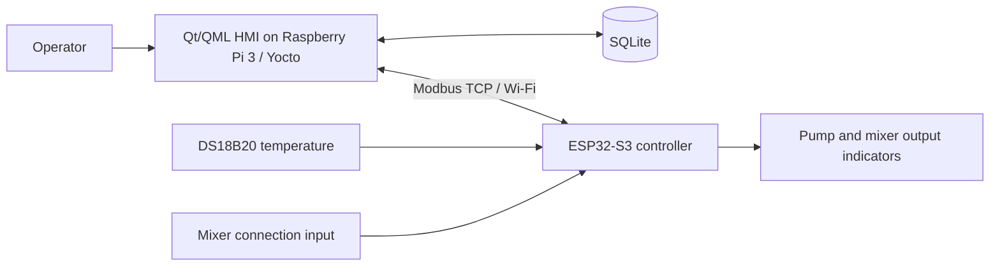

# Lukasz Citko | C++ / Qt / Embedded Systems Portfolio

This repository presents software projects focused on C++, Qt/QML, embedded controllers, industrial process interfaces, and testable application architecture. Each project contains its own source code, build instructions, tests, and technical documentation.

## Featured project

### [MixingStationHMI](projects/MixingStationHMI/)

MixingStationHMI is a distributed batch control prototype. A Raspberry Pi 3 runs the Qt/QML operator interface on a Yocto Project image, while an ESP32-S3 runs the batch process under FreeRTOS. The HMI reads process status, sends commands over Modbus TCP through Wi-Fi, and stores runs, events, and trends in SQLite.

You can also run the HMI on a desktop with its built-in simulation, without an ESP32 or Raspberry Pi.

**[Watch the 90-second Raspberry Pi and ESP32 hardware demonstration](https://github.com/LukaszCitko/QtPortfolio/releases/download/v2.1.0/MixingStationHMI-v2.1-demo.mp4)**

**Technology stack:** C++17, Qt 6, QML, SQLite, CMake, Embedded Linux, Yocto Project, systemd, Weston, ESP-IDF, FreeRTOS, Modbus TCP, Qt Test, Unity, and GitHub Actions.

**What the project demonstrates:**

- An ESP32-S3 state machine that owns the batch process and validates commands using equipment state, faults, and temperature.
- A Qt client that polls snapshots, tracks command acknowledgements, and detects a stalled controller heartbeat.
- A custom Yocto layer that builds a Raspberry Pi 3 image with Qt, Weston, and automatic HMI startup through systemd.
- ESP32-S3 firmware with FreeRTOS tasks, Wi-Fi, Modbus TCP, GPIO outputs, a physical mixer-presence input, and a DS18B20 temperature sensor.
- A touch-oriented HMI based on high-performance HMI principles, with restrained colour and prominent abnormal-state indication.
- SQLite persistence for operators, runs, events, and trends, with tests for reconnecting to an active run and retrying failed history writes.
- Role-aware batch control, fault reset, drain control, and demo user management.
- Automated Qt and firmware builds in CI, host-side Qt tests, and ESP-IDF Unity component tests.

```mermaid
flowchart LR
    Operator[Operator] --> HMI[Qt/QML HMI on Raspberry Pi 3 / Yocto]
    HMI <--> DB[(SQLite)]
    HMI <-->|Modbus TCP / Wi-Fi| ESP[ESP32-S3 controller]
    ESP --> OUT[Pump and mixer output indicators]
    SENSOR[DS18B20 temperature] --> ESP
    INPUT[Mixer connection input] --> ESP
```

[Project overview and build instructions](projects/MixingStationHMI/README.md) | [Yocto image and build instructions](projects/MixingStationHMI/yocto/meta-mixingstation/README) | [Illustrated system guide (earlier revision)](projects/MixingStationHMI/docs/MixingStationHMI-Guide.pdf) | [Qt/C++ source](projects/MixingStationHMI/src/) | [ESP32 firmware](projects/MixingStationHMI/firmware/mixing_controller/) | [Tests](projects/MixingStationHMI/tests/)

## Project status

The hardware prototype has been exercised with an ESP32-S3, physical temperature input, GPIO status indicators, fault indication, Modbus TCP communication, reconnect handling, and run persistence. It remains a portfolio and learning system: its LEDs represent actuator commands, process volume is currently simulated in firmware, and it has not undergone production safety validation.

## License

The original code and documentation in this repository are available under the [MIT License](LICENSE). Third-party frameworks, ESP-IDF components, and Qt remain subject to their own licences.
